# Ingestion and investigation

Agentic SOC treats **events**, **detections**, **alerts**, **cases**, and **campaigns** as
different records. Keeping those boundaries explicit prevents alert duplication,
keeps source provenance intact, and lets every raw event receive cheap deterministic
processing without sending every event to a model.

This page deliberately separates the **version 0.1 implementation** from later
durability and horizontal-scale work. Future-state diagrams are design direction,
not claims about the current release.

## Version 0.1 implementation

| Layer | What is implemented | Version 0.1 boundary |
|---|---|---|
| Connect | 3 pull connectors and 16 push/queue/object-store receiver adapters; all clients in the default `full` image | Live protocol/vendor certification is not yet published; the opt-in `core` image omits cloud/queue clients |
| Normalise | ECS and generic mappings into the OCSF 1.4 event model, with unmapped/raw catch-alls | Mapping coverage varies by source; OCSF conformance profiles are not yet published |
| Ingest | Per-source/feed pull cursors with PIT/`search_after`, bounded late overlap; synchronous push processing with retryable failures | No durable receipt/inbox exists before push processing; several receiver checkpoints are process-local |
| Detect | Source alerts, deterministic routing/risk, rules, persisted aggregate source/cluster baselines, and an event-detection funnel | Realtime baseline signals are advisory; automatic anomaly promotion uses the separately gated event funnel |
| Correlate | Entity strategies, source-scoped case signatures, cross-source related-case links, and campaigns | An open case can still over-merge distant/rule-distinct episodes within one source |
| Investigate | Cheap routing, cached enrichment, compact evidence, two-tier model path, one cost ledger, and a hard daily preflight budget | Investigation is inline rather than a durable priority queue |
| Decide | Pure policy over verdict, confidence, risk, and operator settings | This is the release invariant: models do not close cases directly |
| Present | Cases, investigation trace, memory/RAG, audit, coverage, metrics, and collaboration | Push live-tail evidence is a volatile per-process ring |

See [Known limitations](../releases/known-limitations.md) for the release blockers
behind these boundaries.

## Target low-cost flow

```mermaid
flowchart LR
    subgraph edge["Source edge"]
      A["Pullers and receivers"] --> B["Durable receipt + outbox"]
    end
    subgraph data["Deterministic data plane"]
      B --> C["OCSF normalise + validate"]
      C --> D["Immutable event store"]
      D --> E["Rules + baseline + anomaly"]
      E --> F["Detection envelopes"]
      F --> G["Dedup + correlation graph"]
    end
    subgraph reason["Bounded reasoning plane"]
      G --> H["Priority investigation queue"]
      H --> I["Cached enrichment"]
      I --> J["Compact LLM investigation"]
      J --> K["Deterministic decision policy"]
    end
    K --> L["Case + audit + notification"]
    L --> M["Human feedback"]
    M --> N["Shadow tuning and baselines"]
    N -. "approved versions only" .-> E
```

The key economic property is that **every event enters the deterministic data
plane, while only a small, prioritised fraction enters the reasoning plane**.
Models never sit on the receipt path, never receive unrestricted raw log streams,
and never control acknowledgement.

### Source alerts and system detections

Two signal paths converge without losing provenance:

1. A **source alert** is already a vendor detection. It is normalised into an
   immutable detection envelope, deduplicated by source identity, correlated, and
   placed on the investigation queue at the source-declared priority.
2. A raw **event** is stored once, then evaluated by deterministic rules, rolling
   baselines, anomaly functions, and bounded correlation windows. A match creates a
   system detection that references the event IDs and the exact rule/baseline
   version.

Both paths use the same downstream enrichment, investigation, case, and decision
contracts. A source alert is not silently re-labelled as a system detection, and a
campaign references cases rather than merging their histories.

### Identity and duplicate prevention

At-least-once delivery is the realistic contract across HTTP retries, brokers,
object stores, and pull windows. Agentic SOC should make retries harmless with layered,
versioned identities:

| Identity | Stable inputs | Purpose |
|---|---|---|
| Receipt ID | tenant + source + transport coordinate, or a canonical payload hash | Reject a repeated delivery before reprocessing |
| Event ID | source + native event ID; otherwise source + canonical record fingerprint | Keep two sources with the same vendor ID separate |
| Detection fingerprint | detector ID/version + entity + window + evidence IDs | Deduplicate repeated rule evaluation while preserving materially new evidence |
| Alert fingerprint | source + native alert ID/version | Prevent webhook or queue retries from creating another alert |
| Case signature | correlation policy/version + bounded entity/evidence set | Attach a repeated detection to the active case instead of minting another |

The durable receipt is committed **before** acknowledging the transport. Workers may
then retry normalisation, detection, correlation, or persistence. Poison records go
to a replayable dead-letter stream with their error category and mapping version;
they are not acknowledged as successfully processed and then forgotten.

Exactly-once side effects are achieved through idempotency and an outbox, not by
claiming an exactly-once network.

## Normalisation and the mapping assistant

The current source editor can inspect a pasted sample and make deterministic field
suggestions. A production mapping assistant should extend that safely—it should not
generate executable parser code or silently rewrite a live source.

```mermaid
flowchart LR
    A["Profile 50–200 samples"] --> B["Redact values; keep names, types, shapes"]
    B --> C["Propose declarative OCSF mapping"]
    C --> D["Schema + semantic validation"]
    D --> E["Shadow on holdout traffic"]
    E --> F["Operator approval"]
    F --> G["Immutable mapping version"]
    G --> H["Drift monitor"]
    H -->|regression| I["One-click rollback"]
```

### Safe mapping contract

A mapping version should contain:

- source type and source instance ID;
- target OCSF version, category, and class;
- allow-listed transforms such as rename, timestamp parse, numeric coercion,
  severity table, array projection, and explicit drop;
- required-field, type, range, and enum checks;
- a hash of the sampled field profile—not retained secret or raw sample values;
- validation coverage, unmapped-field rate, parse-error rate, and holdout results;
- author, optional model/provider, approval, timestamp, and parent version.

The optional model sees field names, inferred types, cardinality bands, and redacted
examples. It does not receive credentials or unrestricted production payloads. Its
output is a schema-constrained proposal; deterministic validators and an operator
own activation.

### Shadow and drift gates

For each candidate version, run old and new mappings side by side without changing
the live event. Block promotion when required fields regress, timestamps move
outside a plausible range, entity extraction falls, severity distribution shifts
unexpectedly, or the unmapped/error rate exceeds the operator's bound. Preserve the
old version so historical cases remain explainable.

## Correlation across sources

Cross-source correlation should be a typed, time-bounded graph—not “same IP means
same incident.” Nodes are detections, identities, hosts, processes, cloud resources,
and indicators. Edges carry reason, confidence, first/last seen, source count, and
the policy version that created them.

Recommended precedence:

1. strong identifiers: native alert lineage, endpoint/device ID, cloud resource ID;
2. high-confidence composites: user + host, process hash + host, session + IP;
3. weak indicators: shared public IP or domain, only with tight time and rarity
   evidence;
4. narrative similarity, used for analyst suggestion—not automatic merge.

Late events can extend an active correlation window or link a closed case as related;
they should not silently rewrite a closed decision. Tenant and data-scope boundaries
are mandatory partition keys. Every edge must remain traceable to source event IDs.

## Investigation admission and cost

The investigation queue, not the transport callback, is the spend boundary. A
priority score can combine source severity, deterministic risk, asset criticality,
identity privilege, detector confidence, source reliability, campaign membership,
age, and analyst/SLA urgency.

Cost controls, in order:

1. parse, validate, deduplicate, and suppress deterministically;
2. run rules, baselines, entity correlation, and risk scoring without a model;
3. cache enrichment by indicator and provider TTL;
4. assemble a bounded evidence packet with counts, top entities, timeline, and
   representative references—not a raw-log dump;
5. use the cheap router only when deterministic routing is insufficient;
6. reserve the strong model for admitted candidates;
7. batch non-urgent work, enforce provider concurrency, and meter every call;
8. route budget exhaustion to human review instead of dropping or auto-closing.

Version 0.1 defaults to a hard `$10/day` preflight ceiling with an 80% warning. New
provider calls stop at the ceiling and the case fails safe to `NEEDS_HUMAN`. Because
the check is not an atomic spend reservation, already in-flight calls can complete
slightly beyond it; provider-side budgets remain the final billing backstop.

The design target is for **less than 1% of raw events** to require any model call.
That is an exit metric to measure on reference workloads, not a claim about the
current release.

## Learning without uncontrolled self-modification

Three stores serve different purposes:

- **Operator memory** keeps explicit, attributable facts and preferences.
- **RAG knowledge** keeps runbooks and approved reference material with provenance
  and trust labels.
- **Baselines and feedback statistics** keep bounded numerical observations such as
  entity behaviour, false-positive ratios, and detector drift.

Resolved cases may update statistics and propose threshold, mapping, or rule changes.
They must not directly mutate decision policy or execute model-written code. Changes
are shadow-evaluated, versioned, audited, approved according to policy, and
rollbackable. This keeps “improves over time” measurable and resistant to poisoned
logs or a single mistaken verdict.

## Scale-out roadmap

Version 0.1 runs API, receivers, polling, scheduling, correlation, and investigation
inside one backend process. Do not add replicas until the process-local coordination
is replaced.

| Role | Partition/lease | Scale signal | Scale-down floor |
|---|---|---|---|
| API | stateless behind ingress | request concurrency and latency | 1 |
| Source controller | lease per source/feed or broker partition | poll lag, broker partitions | 1 owner per active pull source |
| Normaliser | receipt partition | queue depth and oldest age | 0 when receipts are empty |
| Detector/correlator | tenant + stable entity hash | events/sec, partition lag, state-store latency | 1 per active partition set |
| Investigator | priority queue with provider-aware lease | oldest high-priority age, queue depth, provider limits | warm 1 for critical SLO; low-priority pool may reach 0 |
| Scheduler | leader lease + idempotent job key | scheduled-job lag | 1 elected owner |
| Realtime gateway | shared event stream, not process memory | subscriber connections | 1 |

An economical first scale-out can use PostgreSQL for state/leases/outbox and Redis
Streams for bounded work queues and realtime fan-out. Scale workers on queue depth
and **oldest item age**, not CPU alone. KEDA or an equivalent autoscaler can be added
when Kubernetes is justified; Kafka is a later option when retention, partitions,
and replay volume demand it.

Backpressure starts at the edge: pause broker consumption, slow pull intervals, or
spool receipts durably before memory fills. Never scale an active pull controller to
zero, and never let model-provider rate limits block receipt acknowledgement.

## Durability maturity targets

These are targets to benchmark and publish on a named reference deployment—not
current guarantees:

| Measure | Exit target |
|---|---|
| Acknowledged-but-unpersisted events in fault-injection tests | 0 |
| Duplicate detections/cases under delivery retry | < 0.1% with every duplicate explainable |
| Critical pushed source alert: receipt to visible case, p95 | ≤ 15 seconds without provider throttling |
| Other source alert: receipt to visible case, p95 | ≤ 60 seconds |
| Raw event to system detection, p95 | ≤ 5 minutes for enabled realtime detectors |
| Oldest high-priority investigation | < 2 minutes under rated load |
| Raw events admitted to any LLM | < 1% on published reference workloads |
| Model calls represented in the cost ledger | 100% |

The release report should state event rate, source mix, hardware, model provider,
failure injections, and measurement window so the numbers are reproducible.
