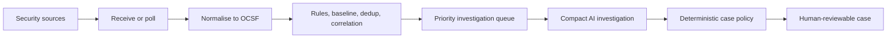

Bleeding Edge preview · 3.0.0-alpha.1

# Security triage that explains every decision.

TLSOC brings source alerts, system detections, correlation, enrichment, AI-assisted
investigation, and human review into one self-hosted console. Events are normalised
to OCSF, expensive reasoning is reserved for compact high-priority candidates, and
deterministic policy—not an LLM—owns close and escalation decisions.

[Start locally](getting-started/quickstart.md){ .md-button .md-button--primary }
[Read the architecture](architecture/ingestion.md){ .md-button }

!!! warning "Alpha means evaluation, not production certification"

    The first public build is intentionally a Bleeding Edge release. It is a
    **single-replica evaluation build** while durable receipt, persistent dynamic
    secrets, schema migrations, and distributed coordination are completed. Review
    [known limitations](releases/known-limitations.md) before connecting real data.

## What the suite brings together

- :material-lan-connect: **One source-neutral console**

  ---

  Pull from Elasticsearch, OpenSearch, or Wazuh; receive webhooks, HEC, syslog,
  queues, and object-store exports through one connector contract.

  [Check source support](sources/support-matrix.md)

- :material-shape-outline: **OCSF at the boundary**

  ---

  Native records are mapped into a canonical security-event shape before
  correlation, scoring, investigation, or case management sees them.

- :material-vector-link: **Alerts plus system detections**

  ---

  Source-native alerts enter triage directly. Raw event feeds first pass through
  cheap rules, baselines, and correlation so routine telemetry never needs an LLM.

- :material-robot-outline: **AI with a cost boundary**

  ---

  The model receives compact, fenced evidence only after deterministic gates.
  Every model call passes through one usage and cost ledger.

- :material-gavel: **Code owns the final action**

  ---

  Models may return a verdict and confidence. A pure, operator-configured policy
  function alone decides whether a case closes, escalates, or needs a human.

- :material-eye-check-outline: **Built for review**

  ---

  Cases keep provenance, investigation traces, status history, collaboration,
  and append-only audit records so an analyst can challenge the outcome.

## From signal to case

The current alpha implements this flow in the FastAPI process. The production
design inserts a durable receipt and queue between transport and processing, then
splits work into independently scalable roles. The distinction between **what is
shipped** and **what is the release target** is documented in
[Ingestion and investigation](architecture/ingestion.md).

## Choose a path

=== "See the product"

    Run the deterministic local demo with Python 3.11 and Node.js 22. It uses a
    mock model and generated security stories, so it costs nothing and touches no
    real source.

    [Run the demo](getting-started/quickstart.md#local-demo)

=== "Evaluate with a source"

    Start the four-service Compose stack, enable authentication, and add one
    read-only pull source or authenticated webhook from the first-run wizard.

    [Start the evaluation stack](getting-started/quickstart.md#evaluation-stack)

=== "Plan a release"

    Use `main` for stable builds, `next` for Bleeding Edge integration, and release
    candidates—not a third permanent branch—for pre-stable testing.

    [See channels and versioning](releases/channels.md)

## Project status

The planned first public artifact is **`v3.0.0-alpha.1`**. The repository has not
yet completed the release blockers listed in the documentation, and live-vendor
certification is not implied by an adapter being present. The code is publicly
visible, but an explicit redistribution license has not yet been selected; do not
describe the project as open source until that decision is committed.

Primary surface: standalone React web console · Backend: FastAPI + LangGraph ·
Canonical schema: OCSF 1.4 · State: PostgreSQL, SQLite, or Elasticsearch

