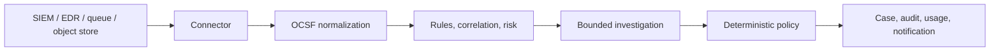

# TLSOC documentation

Turn security signals into explainable, cost-metered cases without handing control to a model.

**Documentation 0.1** describes TLSOC Agentic Triage Suite **0.1.0**. Use the
version selector in the navigation footer when working with another release line;
the channel badge identifies whether the page came from Testing or Stable.

## Start here

| Goal | Read this |
| --- | --- |
| See the product without external infrastructure or model cost | [Run the deterministic demo](getting-started/demo.md) |
| Install the complete standalone stack | [Install TLSOC](getting-started/install.md) |
| Configure an organization for the first time | [First-run setup](getting-started/first-run.md) |
| Trace one alert through triage | [Work your first case](getting-started/first-case.md) |
| Connect a SIEM, queue, receiver, or object store | [Source overview](sources/index.md) |
| Operate or upgrade a deployment | [Operations](operations/deployment.md) |
| Integrate with the backend | [API reference](reference/api.md) |

## What TLSOC does

TLSOC is a vendor-neutral, self-hosted security operations console. It pulls or
receives security records from supported sources, normalizes each record to
**OCSF 1.4.0**, correlates related activity, computes deterministic risk, and
creates human-reviewable cases.

When a case merits model investigation, TLSOC sends compact, explicitly fenced
evidence through a single model gateway. The model supplies a verdict and
confidence; deterministic operator policy alone decides whether the case closes,
escalates, or requires a human.

## Product guarantees

- **Source systems stay read-only.** Pull credentials are scoped to the selected
  data and TLSOC never writes back to an upstream SIEM.
- **Models do not own the final action.** The close/escalate function is pure code
  over verdict, confidence, risk, and operator policy. `NEEDS_HUMAN` can never
  auto-close.
- **Every model call is accounted for.** One gateway records usage and cost and
  enforces the configured daily budget before work begins.
- **Untrusted telemetry is fenced.** Source-controlled values remain labelled as
  untrusted in chat, investigation, retrieval, and tool results.
- **Actions are reviewable.** Cases retain evidence provenance, investigation
  traces, status history, collaboration, and append-only audit records.
- **Storage is selectable.** TLSOC bookkeeping can use PostgreSQL, SQLite, or
  Elasticsearch independently of the upstream log source.

## Documentation by role

### Analysts

Start with the [analyst workflow](analyst/overview.md), then use the guides for
[cases](analyst/cases.md), [investigation](analyst/investigation.md),
[logs and search](analyst/logs-search.md), [campaigns](analyst/campaigns.md), and
[analytics](analyst/analytics.md).

### Detection engineers

Read [automation](automation/index.md), [rules](automation/rules.md),
[tuning and baselines](automation/tuning-baselines.md), and
[playbooks and approvals](automation/playbooks-approvals.md). Source mapping and
custom connector guidance lives under [Sources](sources/index.md).

### Administrators and operators

Use the [settings map](administration/settings.md),
[users and RBAC](administration/users-rbac.md),
[authentication](administration/authentication.md), and the complete
[operations guide](operations/deployment.md). Review [security](operations/security.md)
and [backup and health](operations/health-backup.md) before exposing a deployment.

### Developers and integrators

The [concepts](concepts/architecture.md) explain the trust and data boundaries.
Use [API reference](reference/api.md), [configuration reference](reference/configuration.md),
[permissions](reference/permissions.md), and [development](development/index.md)
for contract-level detail.

## Release status

TLSOC uses one promotion path: feature branches merge into **Testing**, and the
accepted source tree promotes through a protected PR to **`main` / Stable**. The
resulting `main` commit is verified before tagging. Code and images use SemVer
`0.1.0`; this site uses the major.minor documentation line `0.1`.

Read [release channels and versioning](releases/channels.md),
[TLSOC 0.1 release notes](releases/0.1.md), and
[known limitations](releases/known-limitations.md) before deployment.
