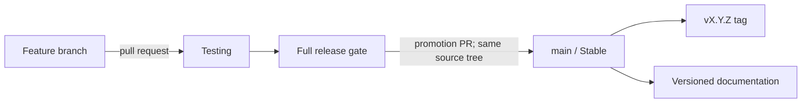

# Release channels and versioning

TLSOC has two release channels and two long-lived branches. Work integrates on
**Testing**. The accepted source tree is then promoted through a protected pull
request to **Stable** on `main`, and the resulting `main` commit is verified.
There is no third prerelease branch and no separate release-branch vocabulary.

## Channel contract

| Channel | Branch | Intended use | Publication |
| --- | --- | --- | --- |
| **Testing** | `Testing` | Integrated changes, acceptance testing, upgrade rehearsal, and documentation review | CI artifacts and documentation preview only |
| **Stable** | `main` | Supported releases and deployment artifacts | Immutable `vX.Y.Z` tag, versioned docs, and Stable image/package metadata |

The branch names and channel names are deliberately different kinds of label:

- write **`Testing`** when referring to the integration branch or channel;
- write **`main`** when referring to the Git branch;
- write **Stable** when referring to the release channel represented by `main`.

Do not use “alpha”, “Bleeding Edge”, “next”, or a generic “production branch” as
synonyms for these channels.

## Version 0.1 nomenclature

The first standardized release line is documentation version **0.1** and product
version **0.1.0**.

| Surface | Canonical value |
| --- | --- |
| Product | TLSOC Agentic Triage Suite |
| Operator interface | TLSOC Console |
| Backend service/API | TLSOC API |
| SemVer package and image version | `0.1.0` |
| Git release tag | `v0.1.0` |
| Documentation selector and URL line | `0.1` and `/0.1/` |
| Integration branch/channel | `Testing` |
| Stable branch/channel | `main` / Stable |

Patch releases remain within the same documentation line. For example, app
versions `0.1.1` and `0.1.2` update the `0.1` documentation rather than creating
new selector entries. A new minor release creates a new documentation line such
as `0.2`.

## Promotion procedure

Every release starts with a candidate commit on `Testing`:

1. Merge focused feature branches into `Testing` through reviewed pull requests.
2. Run the backend, web console, documentation, generated-contract, security, and
   deployment-configuration gates on that commit.
3. Freeze the candidate while acceptance and upgrade checks run. Fix failures on
   a feature branch and merge them back into `Testing`; do not patch `main` first.
4. Promote the accepted `Testing` source tree to `main` through a protected pull
   request. The merge commit may have a different SHA, but the promotion must not
   introduce content changes; re-run the complete gate on that resulting `main` SHA.
5. Create the immutable `vX.Y.Z` tag from the verified `main` commit and publish
   artifacts from that SHA using the same `X.Y.Z` value from the root `VERSION` file.
6. Let the documentation workflow publish the matching major.minor line and move
   the `stable` and `latest` aliases to it.

If a Stable defect is found, fix it through `Testing`, exercise the same gate, and
promote a patch release. Emergency timing may shorten review windows, but it does
not reverse the direction of promotion.

## Release gate

A candidate is promotable only when all required checks pass and the release notes
describe its real operating boundary. At minimum:

- canonical version metadata, OpenAPI, TypeScript contracts, image defaults, and
  release notes agree;
- backend tests, web console lint/tests/build, and strict documentation build pass;
- deployment configuration validates and upgrade/restore steps are rehearsed for
  the affected state backend;
- source credentials remain least-privilege and upstream systems remain read-only;
- model errors fail safe to `NEEDS_HUMAN`, every model call remains cost-ledgered,
  and deterministic policy remains the sole close/escalate authority;
- known limitations and migration steps are updated before promotion.

Passing unit tests does not by itself make a commit Stable. The accepted source,
release metadata, documentation, and published artifacts must describe the same
thing.

## Semantic versioning before 1.0

TLSOC uses `MAJOR.MINOR.PATCH` SemVer for code, packages, and images:

- increment **PATCH** for backward-compatible fixes within a documentation line;
- increment **MINOR** for a new pre-1.0 capability set or a compatibility change
  that needs its own documentation line;
- reserve **MAJOR** for the post-1.0 compatibility contract.

Before `1.0.0`, a minor increment can contain breaking changes. Those changes must
still have explicit migration notes and cannot be hidden behind the Testing/Stable
channel labels.

## Documentation publication

The documentation build follows the same promotion direction:

- a pull request or push to `Testing` runs a strict build and publishes a review
  artifact, but does not move the public Stable site;
- a push to `main` publishes the current major.minor directory with Mike, assigns
  the `stable` and `latest` aliases, and keeps older documentation directories;
- the site version selector prefers the equivalent page in the selected version
  and falls back to that version's home page when the page did not yet exist.

See [Documentation versions](documentation-versions.md) for URL, alias, and
maintenance rules, and [TLSOC 0.1](0.1.md) for this release line.
