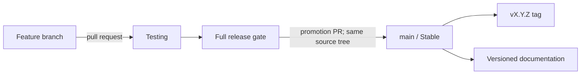

# Release channels and versioning

Agentic SOC's release contract has two channels and two long-lived branches. Work
integrates on **Testing**. The accepted source tree is then promoted through a
protected pull request to **Stable** on `main`, and the resulting `main` commit is
verified. There is no third prerelease branch and no separate release-branch
vocabulary.

!!! note "Current repository topology"

    The remote now exposes both canonical branches and uses `main` as the default.
    Repository administrators must still keep the required pull-request gates and
    the `CI passed` aggregate enforced; a branch name alone never proves that a
    particular build passed acceptance.

## Channel contract

| Channel | Branch | Intended use | Publication |
| --- | --- | --- | --- |
| **Testing** | `Testing` | Integrated changes, acceptance testing, upgrade rehearsal, and documentation review | CI artifacts and documentation preview only |
| **Stable** | `main` | Supported releases and deployment artifacts | Immutable `vX.Y.Z` tag, versioned docs, and Stable image/package metadata |



The branch names and channel names are deliberately different kinds of label:

- write **`Testing`** when referring to the integration branch or channel;
- write **`main`** when referring to the Git branch;
- write **Stable** when referring to the release channel represented by `main`.

Do not use “alpha”, “Bleeding Edge”, “next”, or a generic “production branch” as
synonyms for these channels.

For operators, this distinction is concrete: after `main` is provisioned, an
ordinary clone or pull of `main` receives the last accepted Stable source tree,
never in-progress work from `Testing`. Pulling `Testing` receives the current
integration candidate and may include changes that have not passed release
acceptance.

The Console's **Settings → Organization → Updates & releases** section observes these
two source refs by default. A fork or renamed repository can replace the public GitHub
URL and either branch name without changing the application wire namespace. This is
metadata discovery only: an observed source commit is linked for review and cannot
deploy or activate itself. The actual top-bar update action still requires a different,
already-deployed Console manifest that exactly matches a healthy backend build.

## Version 0.1 nomenclature

The first standardized release line is documentation version **0.1** and product
version **0.1.1**.

| Surface | Canonical value |
| --- | --- |
| Product | Agentic SOC |
| Operator interface | Agentic SOC Console |
| Backend service/API | Agentic SOC API |
| SemVer package and image version | `0.1.1` |
| Git release tag | `v0.1.1` |
| Documentation selector and URL line | `0.1` and `/0.1/` |
| Integration branch/channel | `Testing` |
| Stable branch/channel | `main` / Stable |

Patch releases remain within the same documentation line. For example, app
versions `0.1.1` and `0.1.2` update the `0.1` documentation rather than creating
new selector entries. A new minor release creates a new documentation line such
as `0.2`.

## Promotion procedure

Every release starts with a candidate commit on `Testing`:

1. Merge focused feature branches into `Testing` through reviewed pull requests.
2. Run the backend, web console, documentation, generated-contract, security, and
   deployment-configuration gates on that commit.
3. Freeze the candidate while acceptance and upgrade checks run. Fix failures on
   a feature branch and merge them back into `Testing`; do not patch `main` first.
4. Promote the accepted `Testing` source tree to `main` through a protected pull
   request. The merge commit may have a different SHA, but the promotion must not
   introduce content changes; re-run the complete gate on that resulting `main` SHA.
5. Create the immutable `vX.Y.Z` tag from the verified `main` commit and publish
   artifacts from that SHA using the same `X.Y.Z` value from the root `VERSION` file.
6. Let the documentation workflow publish the matching major.minor line and move
   the `stable` and `latest` aliases to it.

Use an annotated tag and verify it before pushing:

```bash
git switch main
git pull --ff-only origin main
test "$(cat VERSION)" = "X.Y.Z"
git tag -a "vX.Y.Z" -m "Agentic SOC X.Y.Z"
git show --no-patch "vX.Y.Z"
git push origin "vX.Y.Z"
```

Replace `X.Y.Z` with the real `VERSION` value. Published tags are immutable; never
force-update one.

### Changelog discipline

`CHANGELOG.md` has exactly one active top-level **`[Unreleased]`** section during
normal development. Dated work that is not a published release is a **Development
snapshot**, not another `[Unreleased]` section and not a bracketed SemVer release.

As part of the final frozen release-preparation change:

1. move the accepted entries out of `[Unreleased]` under `[X.Y.Z]` with the release
   date;
2. open a new, empty `[Unreleased]` section above it;
3. promote and verify that exact prepared tree on `main`; and
4. tag that exact verified commit immediately.

If promotion is abandoned, revert the prepared release heading rather than leaving
a Testing snapshot that reads as though it were published. Never keep multiple
top-level `[Unreleased]` sections as a dated work log; the development journal and
Development snapshot headings hold that history.

If a Stable defect is found, fix it through `Testing`, exercise the same gate, and
promote a patch release. Emergency timing may shorten review windows, but it does
not reverse the direction of promotion.

## Release gate

A candidate is promotable only when all required checks pass and the release notes
describe its real operating boundary. At minimum:

- canonical version metadata, OpenAPI, TypeScript contracts, image defaults, and
  release notes agree;
- backend tests, web console lint/tests/build, and strict documentation build pass;
- the documented Console release-candidate browser matrix passes on the exact built
  candidate in Light, Dark, and System at desktop and narrow widths, with build SHA,
  release badge, keyboard/focus, loading/error/empty behavior, same-origin Help Center,
  and unexplained console/network errors recorded in a dated receipt;
- deployment configuration validates and upgrade/restore steps are rehearsed for
  the affected state backend;
- source credentials remain least-privilege and upstream systems remain read-only;
- model errors fail safe to `NEEDS_HUMAN`, every model call remains cost-ledgered,
  and deterministic policy remains the sole close/escalate authority;
- known limitations and migration steps are updated before promotion.

Passing unit tests does not by itself make a commit Stable. The accepted source,
release metadata, documentation, and published artifacts must describe the same
thing.

Use the [release-candidate browser acceptance matrix](../development/testing.md#release-candidate-browser-acceptance)
for the required route and interaction coverage. A screenshot of one successful page
is not a Console acceptance receipt.

## Build and badge provenance

SemVer and channel are independent. A Testing candidate and the accepted Stable
build can both report version `0.1.1`; the channel says where that build sits in
the acceptance lifecycle. Stamp the mutable provenance fields explicitly; keep or
override the Dockerfile's canonical source URL as appropriate:

| Variable | Purpose |
| --- | --- |
| `TLSOC_VERSION` | Product/image SemVer; must match the root `VERSION` file |
| `TLSOC_RELEASE_CHANNEL` | `testing` for candidates; `stable` only for the verified `main`/tag build |
| `TLSOC_BUILD_SHA` | Exact source commit |
| `TLSOC_BUILD_DATE` | Reproducible build timestamp |
| `TLSOC_SOURCE_URL` | Dockerfile build argument for the canonical source repository URL stored in OCI metadata; the reference Compose files use its repository default |

The authoritative backend value is
`/api/health/build-info.release_channel`; images also carry
`dev.tlsoc.release.channel`. The Console always shows a top-right
`vX.Y.Z · Testing|Stable` badge. Opening it displays the Console and backend
version, channel, commit, and build time separately. When both identities are
available, only explicit matching Stable stamps render Stable; a version, channel,
or known-SHA mismatch immediately downgrades the session badge to Testing. When
backend build-info is unavailable, the immutable Console build stamp determines the
visible channel and remains inspectable.

The web artifact also publishes a same-origin `/release.json` with its immutable
version, channel, commit, and build time. Serve that file with `no-store` semantics.
The top bar may show **Update available** beside the version badge only when a
different, fully stamped manifest identity exactly matches public backend build-info and a healthy
`/api/health` response. Activation requires operator confirmation and a final
no-store check of the manifest, backend identity/readiness, and `/index.html`; known
unsaved drafts block it. Discovery or preflight failure leaves the current document
running, and the Console never auto-reloads.

Separately, authenticated `settings:read` users may receive a read-only upstream
observation from `GET /api/releases/upstream`. The backend checks only the saved public
GitHub repository and Stable/Testing refs, caches successful metadata, and preserves a
clearly marked last-known-good result when a later check fails. A higher SemVer or a
same-version different SHA may be announced as source for review; an older SemVer is
never called an update. `POST /api/releases/upstream/check` refreshes that metadata
subject to a cooldown. Neither endpoint has Git, deployment, process, migration, or
activation authority.

This is not a release-promotion signal or deployment authority. It activates an
already-deployed coherent web/backend pair; it cannot pull artifacts, restart
services, run migrations, carry deploy credentials, or perform rollback. Operators
must retain the previous build's hashed assets—or use blue-green serving—through the
observation window so an existing tab can continue lazy-loading while the new target
is offered.

Local `run-demo.sh` derives Stable only from a literal `main` checkout; every
other branch, detached checkout, or unknown channel fails safe to Testing unless
an explicit release-build override is supplied. The documentation marquee is a
separate publication badge controlled by `TLSOC_DOCS_CHANNEL`: the Testing docs
job leaves it as Testing, while the `main` publication job explicitly sets Stable.
No badge becomes Stable from SemVer or a similar-looking branch name alone.

CI follows the same rule: `Testing` pushes and pull requests are stamped Testing;
the protected `main` build and canonical `vX.Y.Z` tag build are stamped Stable.
Dockerfiles default to Testing, so an operator-built Stable image must supply the
explicit channel, SHA, and build date rather than relying on a default.

## Semantic versioning before 1.0

Agentic SOC uses `MAJOR.MINOR.PATCH` SemVer for code, packages, and images:

- increment **PATCH** for backward-compatible fixes within a documentation line;
- increment **MINOR** for a new pre-1.0 capability set or a compatibility change
  that needs its own documentation line;
- reserve **MAJOR** for the post-1.0 compatibility contract.

Before `1.0.0`, a minor increment can contain breaking changes. Those changes must
still have explicit migration notes and cannot be hidden behind the Testing/Stable
channel labels.

## Documentation publication

Every Console build first generates its own version-matched Help Center under
`/docs/<major.minor>/`. That installed copy is part of the application artifact and
is authoritative for operating that exact build. Public publication follows the same
promotion direction as the source:

- a pull request or push to `Testing` runs a strict docs-plus-app build and can
  publish a Development review artifact, but does not move the public Stable site;
- a push to `main`, or a manual Documentation run selected on `main`, updates the
  current major.minor history with Mike, assigns the `stable` and `latest` aliases,
  and keeps older documentation directories;
- the generated `gh-pages` branch is the version-history backing store; GitHub Pages
  itself must use **GitHub Actions** as its source, and the workflow deploys a
  validated link-free artifact with the native Pages actions;
- the site version selector prefers the equivalent page in the selected version
  and falls back to that version's home page when the page did not yet exist.

The application rail opens the installed same-origin guide by default. GitHub and the
public Stable/Development sites remain explicit secondary links for source editing,
upgrade comparison, or future-work preview; they never replace installed help
silently.

See [Documentation versions](documentation-versions.md) for URL, alias, and
maintenance rules, and [Agentic SOC 0.1](0.1.md) for this release line.
