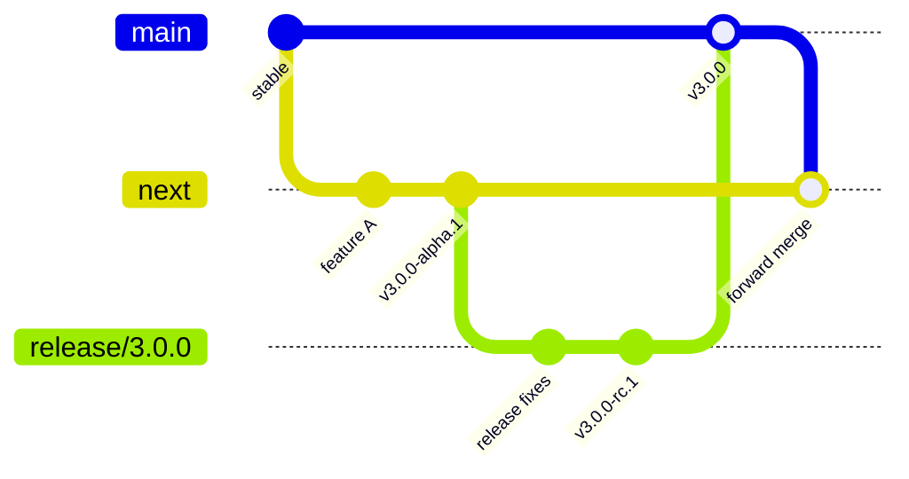

# Release channels and versioning

Use three **release channels**, but only two permanent branches. A permanent
`Testing` branch adds a third merge lane, drifts from production, and makes it
unclear which exact build was tested. Release-candidate tags and a short-lived
release branch provide a sharper boundary.

## Recommended model

| Channel | Git source | Version example | Audience | Stability promise |
|---|---|---|---|---|
| Bleeding Edge | protected `next` | `v3.0.0-alpha.1` | Contributors and evaluation environments | Breaking changes and data reset may be required between alphas |
| Release candidate | short `release/3.0.0` branch and immutable tag | `v3.0.0-rc.1` | Staging and upgrade rehearsals | Feature-frozen; only release blockers are accepted |
| Stable | protected `main` | `v3.0.0` | Production adopters | Documented compatibility and upgrade policy applies |

Feature branches merge into `next`. A release branch is cut only when the alpha
exit gates pass. The exact release candidate artifact—not a moving branch head—is
promoted to `main` after testing.



### Why not `main` + `Testing` + `Bleeding-Edge`?

Three long-lived branches require fixes to be merged forward and backward across
three independent histories. A test result on `Testing` still does not identify an
immutable artifact. With the recommended model:

- `next` answers “what is the newest integrated code?”;
- `vX.Y.Z-rc.N` answers “what exact artifact is under acceptance testing?”;
- `main` answers “what is the supported stable line?”

If a release needs several candidate fixes, keep `release/X.Y.Z` briefly. Delete it
after stable promotion and preserve the immutable tags.

## Transition from the current repository

At the start of this release-readiness pass the repository used `Testing`, a remote
`claude/main`, no public release tags, and no canonical `main` branch. Treat the
following as release work, not a documentation-only rename:

1. Decide which reviewed commit becomes the initial `main` baseline.
2. Create protected `main` and `next`; change the repository default to `main`.
3. Require CI, review, and no force-push on both; allow releases only from protected
   refs.
4. Merge the current Bleeding Edge work into `next` with history preserved.
5. Retire `Testing` after open work is moved and links/workflows are updated.
6. Cut `v3.0.0-alpha.1` from the verified `next` commit.

Do not delete or rename remote branches until open pull requests and automation
references have been inventoried.

## Version source of truth

The root `VERSION` file is canonical and currently carries:

```text
3.0.0-alpha.1
```

The repository changelog already records an earlier `2.0.0` line even though no
public tag/release exists. Starting the public prerelease at `3.0.0-alpha.1` avoids
reusing an identity that downstream users or caches could interpret as the old
build. Reclassifying that history would require an explicit owner decision and a
documented changelog correction.

Release automation must verify the same public version in:

- Python package metadata and `app.__version__`;
- FastAPI/OpenAPI and `/api/health/build-info`;
- the web package metadata;
- backend and web image tags/OCI labels;
- generated SBOM/provenance and release notes;
- the documentation release banner.

Use [Semantic Versioning](https://semver.org/):

- `MAJOR` for incompatible public API, persisted-data, or operator workflow changes;
- `MINOR` for backward-compatible capabilities;
- `PATCH` for backward-compatible fixes;
- `-alpha.N` for Bleeding Edge artifacts;
- `-rc.N` for feature-frozen candidates.

“BE” is a friendly channel label, not the version syntax. Standard prerelease
identifiers sort correctly in registries and tooling. Python tooling may normalise
the same prerelease to its PEP 440 display form; the product tag remains SemVer.

## Promotion policy

### Bleeding Edge

An alpha must be installable, observable, and honest about limitations. Before
tagging:

- backend tests, web build/tests/lint, design gates, and docs strict build pass;
- version-consistency and generated-contract checks pass;
- fresh install and restart smoke tests pass on the reference Compose stack;
- one pull source and one push source complete a synthetic end-to-end case;
- failure tests show retries do not create duplicate cases;
- known limitations and upgrade/reset expectations are in the release notes;
- an SBOM, image digests, checksums, and provenance are attached;
- the explicit project license is present.

The current alpha still has blockers, so passing unit tests alone is not sufficient.

### Release candidate

Cut `release/X.Y.Z`, remove the `-alpha.N` suffix, and start `-rc.1`. Freeze features.
Only fixes for correctness, security, data integrity, packaging, documentation, or
upgrade blockers land. Every fix creates a new RC; never move an existing tag.

Acceptance should exercise:

- clean install and upgrade from the previous supported version;
- backup and restore;
- restart during receipt, correlation, and investigation;
- dependency outage, provider throttling, and state-store failover;
- realistic event rate and same-timestamp bursts;
- source credential rotation and mapping rollback;
- authentication/RBAC and least-privilege source access.

### Stable

Merge the accepted release commit to `main`, tag `vX.Y.Z`, publish the already-tested
artifact by digest, and forward-merge `main` to `next`. Do not rebuild different bits
under the stable tag.

For an urgent stable fix, branch from `main`, release `vX.Y.(Z+1)`, then merge that
commit into `next` and any active release branch.

## Documentation releases

The committed Pages workflow builds public docs in strict mode on documentation pull
requests and deploys only from `main`. That keeps the public URL aligned with the
stable branch. Alpha and RC release notes should link to a versioned documentation
artifact until multi-version hosting is added.

### Publish with GitHub Pages

For a public repository, GitHub Pages can host this static MkDocs output without a
separate documentation server:

1. Open **Repository Settings → Pages**.
2. Set **Build and deployment → Source** to **GitHub Actions**.
3. Protect the `github-pages` environment so only the documentation workflow on
   `main` can deploy.
4. Merge a documentation change to `main` and confirm the **Documentation** workflow
   builds, uploads, and deploys the `site/` artifact.
5. Verify the published URL, search, navigation, canonical links, and mobile layout
   before linking it from a release.

The configured project URL is
`https://arydestroyer.github.io/Agentic-Kibana/`. A custom domain can be added later
without changing the documentation source. See the official
[GitHub Pages guide](https://docs.github.com/en/pages/getting-started-with-github-pages/what-is-github-pages)
for repository visibility and plan details.

Before the first stable release, choose one of these versioning approaches:

- **MkDocs + Mike** for versioned directories and a release selector; or
- a stable site plus immutable documentation archives attached to each GitHub
  Release.

Do not publish internal handoff journals or research scratchpads. The MkDocs
configuration intentionally excludes them from the public build.

## Release notes structure

Each GitHub Release should answer, in order:

1. What is this channel and who should install it?
2. What changed for operators and analysts?
3. Are there persisted-data, configuration, or API changes?
4. How do I install or upgrade?
5. What limitations and rollback steps apply?
6. Which artifacts, checksums, image digests, SBOM, and provenance correspond to
   this tag?
7. Which reference deployment and test report were used?

See [Known limitations](known-limitations.md) for the blockers that must be carried
into the first alpha release notes if they are not resolved before tagging.
